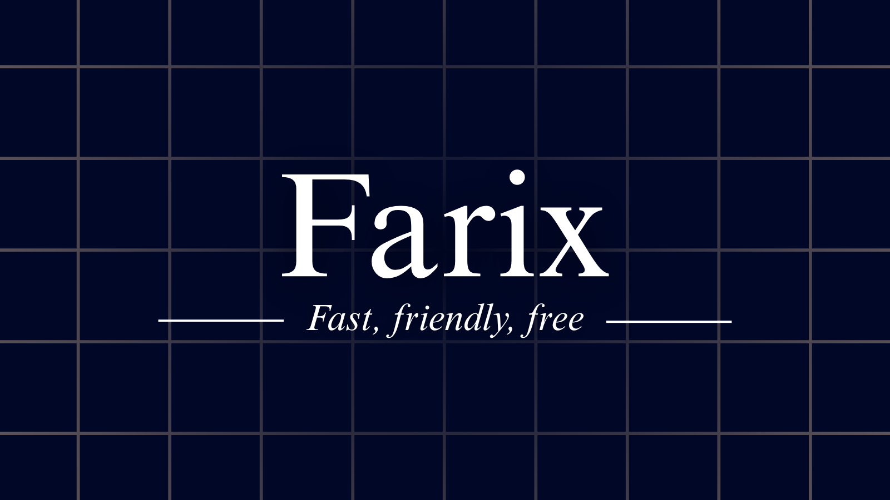

    

<table>
  <thead>
    <tr>
      <th>Component</th>
      <th>Specification</th>
    </tr>
  </thead>
  <tbody>
    <tr>
      <td>Target Architecture</td>
      <td>Intel x86 (i386 / 32-bit)</td>
    </tr>
    <tr>
      <td>Bootloader</td>
      <td>GRUB</td>
    </tr>
  </tbody>
</table>

> *"I'm doing a (free) operating system, (just a Hobby, won't be big and professional like gnu)"* - Linus Torvalds, 1991

An *(unfinished)* operating system I am designing, inspired by Linux and built on Caffeine. Note that I am not exactly the best OS Designer, but I have tried my best to leave comments almost everywhere to explain everything. An OS is something every developer wants to make, but almost everyone lacks the knowledge, courage, or maybe they just don't have the time. Fortunately, I have a lot of free-time, and I am stupid enough to think I can pull off building an OS. The only thing covering my idiocy is the smart people who wrote the [OSDev Wiki](https://wiki.osdev.org).

Refer the [changelog](CHANGELOG.md) for the changes made on each commit.

---

*This project is licensed under the **GNU General Public License v3.0**. See the [LICENSE](LICENSE) for details.*
