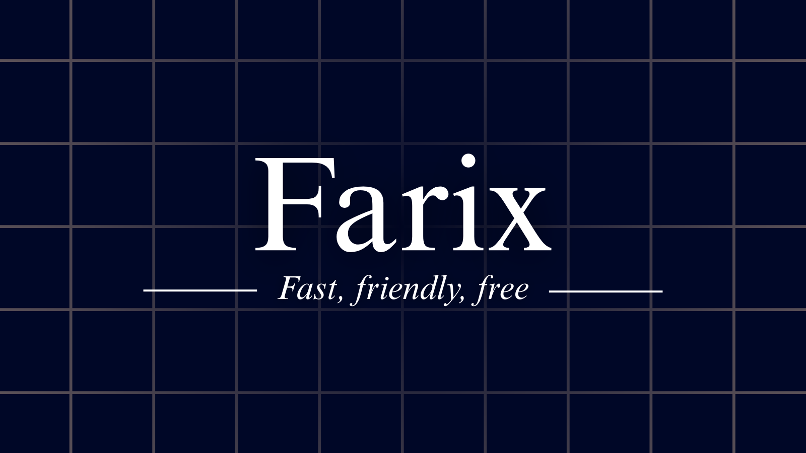

    

> *"I'm doing a (free) operating system, (just a Hobby, won't be big and professional like gnu)"* - Linus Torvalds, 1991

The project is currently unfinished, and I have a [journal](docs/journal.md) that I update consistently with each new commit. Install instructions can also be found at [setup.md](docs/setup.md).

Refer the [changelog](CHANGELOG.md) for the changes made on each commit.

---

*This project is licensed under the **GNU General Public License v3.0**. See the [LICENSE](LICENSE) for details.*
