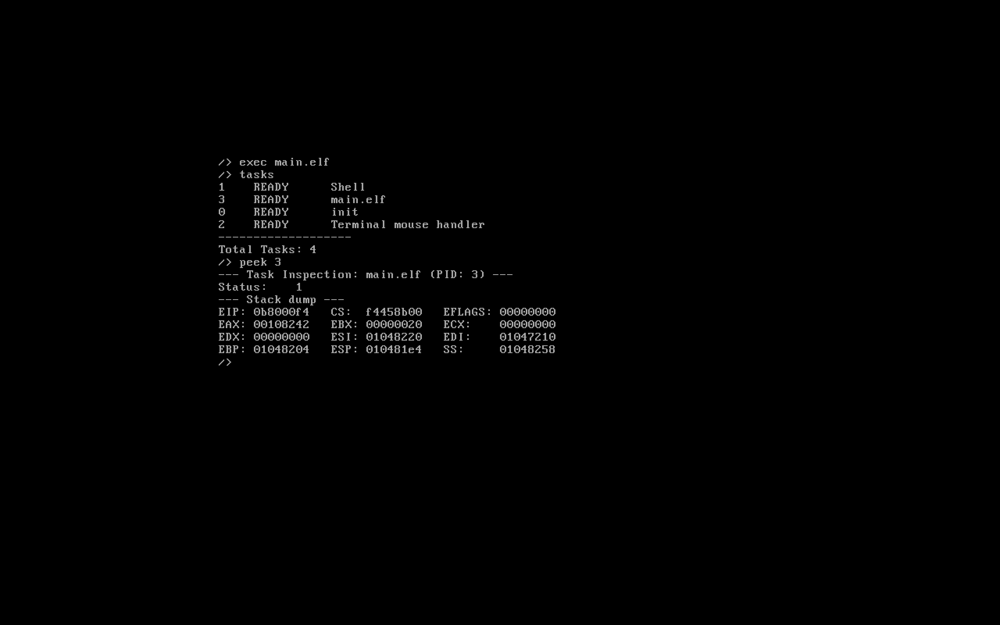
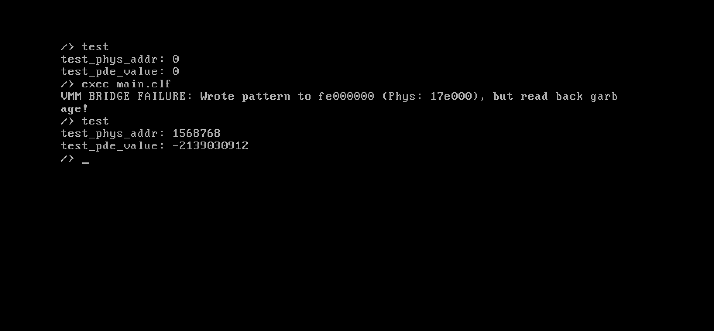

# Journal

*Refer [CHANGELOG.md](../CHANGELOG.md) for only list of changes.*

This is more of a journal of how this project was built. It helps to keep track of the thoughts, and maybe it would help someone, though it is most likely that my methods for anything are far inferior to anything you may be able to come up with.

- [16 Feb: Initial Commit](#initial-commit---16th-feb-2026)
- [17 Feb: Complete memory stack](#complete-memory-stack---17th-feb-2026)
- [18 Feb: Shell](#shell---18th-feb-2026)
- [19 Feb: Multithreading](#multithreading---19th-feb-2026)
- [20 Feb: Ramdisk file system](#ramdisk-file-system---20th-feb-2026)
- [22 Feb: Global Descriptor Table](#global-descriptor-table---22th-feb-2026)
- [23 Feb: FAT32 file system](#fat32-file-system---23th-feb-2026)
- [24 Feb: Change Directory Shell Command](#change-directory-shell-command---24th-feb-2026)
- [26 Feb: Standard C Library](#standard-c-library---26th-feb-2026)
- [27 Feb: Tasks command](#tasks-command---27th-feb-2026)
- [28 Feb: Mouse implementation](#mouse-implementation---28th-feb-2026)
- [28 Feb: Terminal scrolling](#terminal-scrolling---28th-feb-2026)
- [2 Mar: FAT32 Sector limitation removal](#fat32-sector-limitation-removal---2nd-mar-2026)
- [2 Mar: ANSI Escape codes](#ansi-escape-codes---2nd-mar-2026)
- [3 Mar: ELF Loader](#elf-loader---3rd-mar-2026)
- [4 Mar: ELF Executor](#elf-executor---4th-mar-2026)
- [6 Mar: Error handling](#error-handling---6th-mar-2026)
- [8 Mar: Pipe Shell Operator](#pipe-shell-operator---8th-mar-2026)

## Initial commit - *16th Feb, 2026*

With the initial commit, the README.md contained this paragraph that I am moving here:

> An *(unfinished)* operating system I am designing, inspired by Linux and built on Caffeine. Note that I am not exactly the best OS Designer, but I have tried my best to leave comments almost everywhere to explain everything. An OS is something every developer wants to make, but almost everyone lacks the knowledge, courage, or maybe they just don't have the time. Fortunately, I have a lot of free-time, and I am stupid enough to think I can pull off building an OS. The only thing covering my idiocy is the smart people who wrote the [OSDev Wiki](https://wiki.osdev.org).

In the very first commit, I think I had been working on it for 2-3 days, and I only had a basic kernel set up. Looking back at it, it was terrible, because I barely understood what each piece of hardware was really doing. Matter of fact, I didn't even know what anything does except a little bit about the CPU. At the time, I was proud with it, because it was able to take keyboard input. It was incredibly frustrating, and I even resorted to asking Chat-GPT how to solve my problem. It seems no AI was able to help me, and I eventually tinkered around and researched enough to finally get it working. At the time, it was literally a text editor, and it had absolutely no functionality. I make sure to write everything myself without any AI assistance, but Chat GPT and Gemini failing to help me was the more frustrating than the problem itself. They sound so confident, yet obviously wrong, that it just pisses off that one neuron in my head.

It should be noted that my annual exams were going on at school, and I am in class 11, so I didn't have much time to properly build the OS, but I genuinely wasn't bothered over marks, so I just kept building the OS.

## Complete Memory Stack - *17th Feb, 2026*

This was perhaps the most annoying thing I could implement, and I remember it took the entire day. Frustratingly, when debugging the code, I could never understand if the error was in the PMM, VMM, or the heap allocator. Eventually, I somehow got it working, but not well enough, it would come to bite me back a couple times in later additions.

I also just threw every file into a single folder and had no clean structure, and I knew it would be annoying in the future, so I started refactoring the code to move the header files and the C++ files off into separate folders.

## Shell - *18th Feb, 2026*

The day before, I reorganized the code, but felt it was still going to get messy, so I structured every file to move into its own folder inside the [`src`](../src/) and [`include`](../include/) folders.

I decided that I also wanted my own implementation of the string class, because I wanted to implement the shell, and I wanted a clean way to organize a set of characters. Normally, you'd get stuff like strings, maps, heap, etc. through the standard library, but the standard library is provided by the OS. Our problem is that we are making the OS, so there is no standard library to work with - we have to make everything.

I made the shell, and it was nothing special, it just had a few basic commands: `help`, `clear`, `memstat`, and `echo`, and they were practically one line implementations. I also had the up and down arrow keys working, but manage to break it in a few changed later.

In any other project, the more implementations I added, the more complex the project became, till I eventually get tired of it and abandon it. This project was a curious one - the more implementations I add, the easier it gets to program the rest of it. This also meant I had to structure my implementation order such that everything would be well woven together. Unfortunately, I lacked the foresight to see how much of a failure my string class was, until much later down the project.

For some reason, I had the thought that I could implement the standard library myself in time. Quite obviously, I never make my own standard library.

## Multithreading - *19th Feb, 2026*

[This](https://wiki.osdev.org/Creating_an_Operating_System) page that was randomly scrolling through the previous night is where I find a list of missing features in my OS. The one I thought was easiest to implement that I didn't have yet was multithreading.

I looked at how other operating systems do it, and, to be honest, I don't like them, and they seem way too complicated for me to implement. I noticed that I *can* just build a basic system, and the part of the OS that manages each task can use a different data structure or algorithm later down the line. For now, my priority was simplicity.

The most straightforward way to have a set of tasks to iterate through may have been using a `struct`, such that each task object holds the actual function it has to do, as well as a pointer to the next text it has to go to. The idea was simple: each task would point to the next task, and the last task would point to the first task. This would form a circle, i.e. if you had three tasks $T_1$, $T_2$, and $T_3$, then $T_1 \rightarrow T_2 \rightarrow T_3 \rightarrow T_1 \rightarrow \ldots$, and thus this would go on forever till the OS ultimately ends. Each task also is given $10$ milliseconds to do their job, and I don't care about priority right now.

After that, I just had to design the `create_task` function to just change the `next` pointer of the current task to the new task, and set the new task's `next` pointer to the old `next` pointer of the current task.

As the OS grows, there would be much more tasks running than a couple, so there are obviously many places to optimize that I have thought up of, but I am too lazy to implement them right now, and I don't see the point in it.

1. Don't use a circular singly linked list. Use something else.
2. Use a separate 'pool' for sleeping tasks instead of leaving them on the main chain.

There are obviously more ways that I am not able to think of right now, but I know they exist.

Now, I am sure every developer had to debug something, and would spam `print` everywhere to find exactly where it crashes. In our OS, nothing informs us of an error, except the OS literally reboots, which was my only indicator for error. So, I overloaded the `echo` function from the terminal to integers too.

Also, remember when I said the heap allocate was terrible and needed much refactoring throughout the project? This was the first time. I noticed that we kept crashing no matter what I did to the task, and it doesn't crash if I remove the `malloc` and just fix it to something. I realised my heap allocate had a terrible problem - it had a maximum limit, and exceeding it meant it won't give you anything, and the OS crashes.

This was quite straightforward to fix - if we get to the end of the function without having an address to give up, just expand the heap, do the same `malloc` again. Right after implementing that, everything started working again.

## Ramdisk file system - *20th Feb, 2026*

As previously mentioned, the OSDev Wiki gave me a list of stuff I had to add. One of them was something I really wanted - a proper filesystem. Unfortunately, I found this complicated, and I wanted something simple, so I decided to start with ramdisk.

The principle of it is simple, as all it does is store your files and folders in memory. This also meant that if you turned off the system and turned it back on, nothing would be there again. That wasn't a problem for me, because I just wanted *some* file system.

To make this, I made my implementation of `map`, which, like `string`, would be terrible, useless, and absolutely worthless. Just to help me out a bit more, I also implemented a split method and a count method in the string. I am not even sure why I made them the way I made them, because later when I implement a Standard C Library, the old code becomes completely incompatible.

To interact with the new memory-based file system, I implemented very basic `touch`, `cat`, `write`, and `rm` for the shell. I have no clue why it is named `touch` (to make a file) and `cat` (to read a file), personally I would've gone with `create` and `read`, but whatever. I am also aware Linux has no `write` and uses the `echo` to write into a file, but I don't have that much fancy features to do that yet.

I had the foresight to realise that the file system needed an abstraction. I thought of having an `enum` store each of the file, then just use a switch statement to get the function we need to use, but I realised how terrible it was to use, and resorted to using an abstraction. I made sure to Google (in Gemini) if the thing I came up with has a name, because I was unsure of what to name it, and found its called a "Virtual File System"... for some reason, as if the other file systems *aren't* virtual, but I suppose VFS isn't even a file system, it's an abstraction.

## Global Descriptor Table - *22nd Feb, 2026*

The day before this commit, I did a lot of research on what this even is. I realised how terribly terrified I was to implement this, because I was horrified at the prospect that everything needed to be changed and refactored for this to work. I tried to find ways to avoid it, but it seemed inevitable. So, I went through the implementation, made the appropriate stuff, created the `init_gdt`, and made it run in the kernel.

When I started it, I was absolutely sure everything would fail, and I'd have to go on a scavenger hunt for problems that were almost impossible to identify. You can imagine my shock when I started it and found everything perfectly functional. I did not have to change a single character in any other file, and it worked the same. I thought maybe I forgot to put it into the kernel, but it was there. I closed it and restarted it, and it still worked? How? I spent a day stressing about how this would require me to refactor **everything** and absolutely **nothing** had to be changed? This was so strange, the changelog for that day reads:

```md
- **GDT**: Suspiciously works without refactoring anything else
```

I was so pleased to know this, it boosted my confidence to the next thing, which absolutely tore apart the newly-found confidence.

## FAT32 file system - *23th Feb, 2026*

Disks aren't the same as memory, and they remain even after it is closed and rebooted. Since I am simulating the OS, I have to create a `disk.img` file to act as a disk. The piece of hardware responsible for writing and reading onto the disk is called the ATA. I then did my research on FAT32, and I heard it was the easiest one to go with right now (it was not).

In the very first implementation, I hard-coded it to only work with the first sector of the directory, and I wasn't bothered with the specifics, as I just wanted a working version. I somehow got it all working, and passed it to the VFS abstraction layer. I had to make a `vfs_mount` function that would let you 'mount' onto a specific file system, so that I can swap between ramdisk and the FAT32 file system easily.

I also made the VFS abstraction layer take a `get_all` function, which just gives back the head of a linked list of `FileNode`, that the function using can go through. I remember trying to use an array, but using one would mean I would have to iterate through it once to get the length of the array, and then a second time to add each value into the array. I didn't like that at all, and the way to fix this was to build my own version of the `vector` that the standard library provides. I didn't want either, and made the creative decision in opting for a linked list, because it was just easier to use, and I had gotten fond of them since my multithreading implementation.

I also should note, that for simplicity, the root directory was defined to be "", simply because everything was going to use absolute paths, so the leading "/" would be redundant. Furthermore, the shell was to be responsible for resolving relative paths.

I also wanted folders, so I made the `mkdir` command in the shell. The side-effect of all these were straightforward: the `map` and `string` implementations needed more methods. Specifically, `keys`, `capacity`, and `getEntryInternal` for `map`, and `upper`, `substr`, `find`, `starts_with`, `ends_with`, and `contains` for `string`. Again, I am not sure why I made any of these the way I made them, because the standard library doesn't work the way I made them to be.

There were some memory problems, so I tried to increase the stack size from 16 KiB to 64, which is extremely generous. I found out the problem was, and brace yourself, the heap allocator. When the heap expands, it doesn't properly connect back. There were some more issues, but I was just too tired with the FAT32 implementation, that I just gave up and went to sleep.

## Change Directory Shell Command - *24th Feb, 2026*

I was too tired to make anything cool, so I just implemented the `cd` command. All I had to do what make the shell keep track of where it was, and just keep resolving the path whenever we use a file. I did need to change the `substr` method in the string class for it though.

## Standard C Library - *26th Feb, 2026*

This is where I regret my `string` and `map` implementations.

That OSDev Wiki page mentioned how a standard library would be important to have. When I looked it up, I realised that the standard library was *slightly* larger than I thought, and that I am never making that in time. I wanted to have a functional and clean kernel before my class 12 started (4th of the next month), so there was no way I could make all of it in one week.

I resorted to just using `newlib`, but that required me to explicitly define out everything for it, which wasn't a problem since we already made everything. The *real* problem came when I wanted to stop using my `string` and `map` class for the standard library's implementations. Confidently, I deleted the `string` and `map` implementations, and went through each file, painstakingly editing everything to match the standard library. I had to literally rewrite the entire FAT32 system's code. It was a nightmare, that I somehow survived. Of course, because of all the changed, I went an checked if everything worked - it did not. The FAT32 file system was completely broken, nothing seemed to work, and I was getting frustrated.

Initially, the kernel kept crashing whenever I tried to create a file and read it, but it would crash very weirdly. If I created a file, wrote to the file, then read it, it would crash. If I rebooted the OS and used a file I had already written to, then I can read it as many times as I want without problem, until I try to write to it, then it would crash. In fact, this was so random and bizarre, but had a clear pattern, because it would occur only in specific sequences, and I thought the file system was flawed. While debugging, I ran (if I recall properly) the `help` command twice by accident - it crashed! That was news, because that meant the problem was not the file system, but somehow the new `libc` introduction.

Unfortunately, I was already a bit too deep inside this, and I refused to undo all the progress because "I can't figure this out." It was because of, and to the surprise of absolutely nobody, the heap allocator. I tinkered around, until I found the problem through a very shoddy function that points at a heap corruption when it occurs. Apparently, reading a file would corrupt the heap addresses, and when I try to write to a file, it would read garbage data, and just crash. This was true for almost every function - even `help`. I eventually find where the problem originated from, and patched it.

These heap allocator problems were obviously becoming ridiculous, and the `memstat` function was very useless at telling me what was going wrong exactly. So I refactored the shoddy function I made to point at heap corruptions into a feature, and made the `memstat` command tell me exactly where heap corruptions are. This would help me pinpoint the source of all errors in the heap allocator from now on.

If I had to start over this project, I would definitely create the bootloader first, then a terminal, keyboard support, memory management, and immediately implement the standard library right after. Had I done that, I could've saved myself this headache.

## Tasks command - *27th Feb, 2026*

I didn't feel like making much, so I only made a single shell command, `tasks`, that echoes all the currently running tasks.

I also made the heap allocate inform us of what each and every memory address is doing, because I thought that was very cool. Also, all the logic of `memstat` was moved to the `heap.cpp` file instead, for the sake of cleanliness.

Since the introduction of using `printf` instead of `echo`, the help command wouldn't indent properly, so I fixed that too - it was just to multiply the indent by 2, so that the stuff more than 4 characters wouldn't collide with the ones less than 4.

## Mouse implementation - *28th Feb, 2026*

The `memstat` implementation from the previous day would print the memory addresses really quickly, and each on a new line. There was no way to actually scroll up to the contents above the screen.

I could make the scroll through the terminal, or finally implement the mouse. Unfortunately, the mouse behaved very differently from the keyboard. Eventually, I figure it out, but it was a pain to configure the `init_mouse` function, because of which, I also made an `init_keyboard` function.

I was happy with the mouse. During testing, I noticed it properly found relative positions (touchpad/mouse conveniently don't keep track of absolute positions), as well as left and right click, and even the scroll.

## Terminal scrolling - *28th Feb, 2026*

I finally got the mouse to do the reason I made it - scroll. I don't care about anything else as of now. It was unfortunately a pain to do this, because I accidentally kept saving the lines wrong. I would save top most line to the bottom when we moved the terminal down a line, so the line order gets messed up.

I used a doubly linked list to manage this, so it was annoying to debug. I asked Gemini to write me a function to just print our the linked list out into my computer's terminal, since I can't really use the terminal in my OS, as I am debugging it, and it doesn't work. I found the error, patched it, and it seems to work.

I also made a `kill` command in the shell to kill a running task, which could be greatly improved on:-

- Have a buffer store the *to be made dead* tasks, so that when the `schedule` function gets to it, it just sets it to dead and deletes it, instead of pausing the whole system and getting them and stopping it.
- Alternatively, use a doubly linked list, so we can get the immediate previous task, making removal $O(1)$.

But, like the rest of the multithreading implementation, I chose the simpler approach: To "kill" a task, you just pause the entire system, find that task, set its state to `DEAD`, and leave it. Eventually, the `schedule` function cleans it up and gets rid of it.

## FAT32 Sector limitation removal - *2nd Mar, 2026*

I start wanting to have the shell as an application in the operating system's file system, rather than a part of the kernel itself. The first way I wanted to fix this was by ensuring the file systems were robust and had no problems - there were problems. As earlier mentioned, I hard-coded the FAT32 file system to look only at the first sector of the directory. I fixed it by making it now look till it finds our file.

Besides that, I also realised how little storing only 200 lines was, so I made the terminal store the past 500 lines instead. While looking at the terminal's code, I spotted this line in `init_terminal`:

```cpp
terminal_color = vga_entry_color(VGA_COLOR_LIGHT_GREY, VGA_COLOR_BLACK);
```

I had completely forgotten to implement colors to the terminal, which is done generally using ANSI escape codes. I decided to leave it for the day and do it the next day.

## ANSI Escape codes - *2nd Mar, 2026*

Initially, my idea was to have this number that I actually left in the previous commit:

```cpp
// terminal.h
#define ANSI_COLOR_BASE 0xE000
/*              | ANSI_COLOR_BASE | color
 | Reset   | 0  | 0xE000
 | Black   | 30 | 0xE01E
 | Red     | 31 | 0xE01F
 | Green   | 32 | 0xE020
 | Yellow  | 33 | 0xE021
 | Blue    | 34 | 0xE022
 | Magenta | 35 | 0xE023
 | Cyan    | 36 | 0xE024
 | White   | 37 | 0xE025
 */
```

The idea was that I would have the `echo_char` look for characters bigger than the `ANSI_COLOR_BASE`, and we could assign special characters based on that number, and manage the ANSI escape characters using it. So, in the `syscalls.cpp` file, I wrote a function to parse a string with a simple logic: replace all ANSI escape code with `ANSI_COLOR_BASE | color`, and I was only focussed on colors at the time.

I thought it was a clean solution, but the parse was the most annoying thing to implement, so I just gave up on it and made a function directly in the terminal to handle it. Not only did it work, it would also be faster, because we skip a parser overhead. There is nothing to explain about the function, because it's literally just a bunch of if-else statements that eventually cover every case.

## ELF loader - *3rd Mar, 2026*

March 3rd is the day I actually write this journal, clean up the repository, etc. I wanted to be able to run the shell as an executable within the OS itself, i.e. the shell as an ELF executable file in the file system, and then we have some `exec` function that takes the path to it, and we just read it, and we execute it. Unfortunately, looking into executing stuff, I realised that I had certain stuff missing. For starters, my program never bothered about user mode (ring 3), and just let everything in kernel mode (ring 0).

The fix is fine as far as I can tell; the GDT, IDT, etc. were all perfectly fine with the ring 3 implementation. Before I moved on, I made sure to create a new chat with Chat-GPT and ask it about ring 1 and ring 2, and it said:

> Almost nobody uses ring 1 and 2.

As a result, I decided not to implement it. It seems the only places I *did* have to change was with the VMM, because `vmm_map_page` would map out a page in ring 0, when I really would only need it for ring 3. `init_vmm` maps out at ring 0, and that was perfectly fine, because that is the function the kernel uses. This fix was very trivial, and I even had the variable defined and just never used it:

```cpp
// vmm.cpp
// PAGE_USER was defined in vmm.h already
dir[pd_index] = (uint32_t) new_table | PAGE_PRESENT | PAGE_RW | PAGE_USER;
```

I found I had to make this thing called the TSS, which I quickly learned from Chat GPT, because I couldn't be bothered to learn everything through books or websites. All it does is set up a nice stack for the new executing file to use, so that it is in user mode, and isn't using the memory and stuff of the kernel.

I finally made [`elf.h`](../include/fs/elf.h) and [`elf.cpp`](../src/fs/elf.cpp). I made a very basic function, `elf_load_file`, whose entire purpose is to just set up all the memory and stuff for the actual ELF to execute. I can technically let everything run at ring 0, but then I'm not really building an OS, and I would feel dissatisfied, so I tried to implement ring 3, and it hopefully works. If we don't set up a very nice place for the ELF to execute, then the ELF can execute inside the kernel, and access kernel stuff, and that makes it ring 0. In my eyes, an OS is like the bridge between software and hardware, so I **needed** the programs to run in ring 3.

Of course, with the very first version of that function, I created a temporary C program, compiled it into an ELF file, and put the file (named `main.elf`) into the `disk.img`, then went to the kernel, and put:

```cpp
// kernel.cpp
elf_load_file("main.elf");
```

Of course, I expected to see nothing happen, but I saw something (unfortunately). It seemed that the program would boot, crash, reboot, run the kernel, crash, reboot, and this cycle went on forever. It seemed I had made an error. After immense tinkering, I eventually find our problem, although you should never ask me why this solved it. I just left something in my notes, and didn't put it because I thought we didn't really need it. I had to make `boot.s` let us use the `stack_top`.

```asm
.global stack_top
```

Then set `esp0` for the `tss_entry` to the address of that value:

```cpp
tss_entry.esp0 = (uint32_t) &stack_top;
```

I only saw that there was no crash, and there was no indicator it worked. I didn't like being in the dark, because it could somehow just not have functioned or something had gone wrong, and I wasn't really in user mode for it. To test this, I ran the OS through some more parameters:

```bash
qemu-system-i386 -monitor stdio -kernel farix.bin -drive format=raw,file=disk.img,index=0,media=disk -device virtio-mouse-pci
```

The `-monitor stdio` would let us sort of interact with the OS from our terminal as it is running. It is useful, because when I ran `info registers`, to get the values at the registers, I got:

```
CPU#0
EAX=01001a00 EBX=00000000 ECX=00000000 EDX=00101300
ESI=00000000 EDI=00000000 EBP=01002b5c ESP=01002b5c
EIP=00101404 EFL=00000246 [---Z-P-] CPL=0 II=0 A20=1 SMM=0 HLT=0
ES =0023 00000000 ffffffff 00cff300 DPL=3 DS   [-WA]
CS =0008 00000000 ffffffff 00cf9a00 DPL=0 CS32 [-R-]
SS =0010 00000000 ffffffff 00cf9300 DPL=0 DS   [-WA]
DS =0023 00000000 ffffffff 00cff300 DPL=3 DS   [-WA]
FS =0023 00000000 ffffffff 00cff300 DPL=3 DS   [-WA]
GS =0023 00000000 ffffffff 00cff300 DPL=3 DS   [-WA]
LDT=0000 00000000 0000ffff 00008200 DPL=0 LDT
TR =002b 00166f80 00000068 00008900 DPL=0 TSS32-avl
GDT=     00166f40 0000002f
IDT=     00166720 000007ff
CR0=80000011 CR2=00000000 CR3=0017b000 CR4=00000000
DR0=00000000 DR1=00000000 DR2=00000000 DR3=00000000 
DR6=ffff0ff0 DR7=00000400
EFER=0000000000000000
FCW=037f FSW=0000 [ST=0] FTW=00 MXCSR=00001f80
FPR0=0000000000000000 0000 FPR1=0000000000000000 0000
FPR2=0000000000000000 0000 FPR3=0000000000000000 0000
FPR4=0000000000000000 0000 FPR5=0000000000000000 0000
FPR6=0000000000000000 0000 FPR7=0000000000000000 0000
XMM00=0000000000000000 0000000000000000 XMM01=0000000000000000 0000000000000000
XMM02=0000000000000000 0000000000000000 XMM03=0000000000000000 0000000000000000
XMM04=0000000000000000 0000000000000000 XMM05=0000000000000000 0000000000000000
XMM06=0000000000000000 0000000000000000 XMM07=0000000000000000 0000000000000000
```

We actually don't care about anything here except the `CS` register, but looking at it, it has the value `0008` - ring 0. Meaning our program never left into ring 3. Furthermore, the `EIP` register should have had something bigger than `0x40000000`, because that was what was defined for the ELF file we're testing. Rather, the value is, evidently, still at the kernel - `00101404`. The `CR3` entry should also be the address of the `user_pd` variable defined inside `elf.cpp`, and we can see it has loaded.

I put `printf` everywhere to just print out the value of every variable, and on this specific print:

```cpp
// elf.cpp
printf("Entry: %x, Stack: %x\n", header.e_entry, user_stack_top);
jump_to_user_mode(header.e_entry, user_stack_top);
```

I saw the output in my terminal:

```
Entry: 4000000, Stack: c0000000
```

Which was fantastic, as that is exactly what I needed. This implied that the error must have been a page fault, and because there really was no error handling, it would silently fail and quitly slip back into the kernel's memory, which is ring 0. Now, curiously, the problem was not in any of the files, but rather in the `main.elf` file. The C program that is compiled to the ELF file was:

```c
// test file: main.c
void _start() {
    // A simple calculation to verify execution in GDB or via registers
    int a = 5;
    int b = 10;
    int c = a + b;

    // Since we don't have syscalls wired up yet,
    // we just loop forever so the CPU doesn't run off into garbage memory.
    while(1);
}
```

I thought this would work. The reason this didn't work is genuinely frustrating, and, I have to be honest, Gemini told me why it doesn't work, and there was no way I was going to figure this out. Essentially, this program *does* work, but not in the way we want it. When the compiler compiled this code, it saw that `a`, `b`, and `c` were all not used, so the compiler just deleted them from existence, and reduced our sample code to just a `jmp` instruction:

This does work, and the program properly executed, which is why we got the kernel to exist and not crash. The problem was that I had no way of seeing that it worked, because there was absolutely no feedback. Which is why I changed it out for this, to make sure we get feedback:

```c
// test file: main.c
void _start() {
    asm volatile("mov $0x1234, %eax");
    asm volatile("cli"); // This will trigger a General Protection Fault in Ring 3
    while(1);
}
```

Because this is supposed to be in ring 3, `cli` is forbidden for it to use, so this would cause an error and tell the kernel, which would crash the kernel - feedback, exactly what I wanted. The `volatile` keyword makes sure that the compiler doesn't delete our stuff just because they do nothing. When this was compiled into an ELF file, and loaded on our OS, it worked - well it crashed, but that's it working! I also can verify it was working, because the earlier command to run `info registers`, told me:

```
EAX=00001234
```

That number came from the ELF file, which moved the value `1234` into the EAX register, which was further proof that it was working. This means that the CPU successfully:-

1. Switched to the new Page Directory.
2. Loaded the ELF into memory.
3. Jumped to Ring 3.
4. Performed the `mov eax, 0x1234` instruction.

I was too tired to continue on this anymore, so I left it, I'll add the rest of it for the next day. Unfortunately, my class 12 starts the next day, and it's honestly frustrating how little time I get. Fortunately, because it is Ramadan, the timings are much more nicer - 7 am to 12, but after that the timings are terrible - 7 am to 3 pm. It used to be till 2 pm, but the new principal says that "there isn't time for the syllabus to be finished in time", while the portions are literally less than the previous yes. I am not sure why, and adding that extra hour messes up everyone's life schedule, and I am not going to be able to work on this OS properly. Additionally, the school used to let Friday and Saturday be weekends, so it was the only time you could rest, but they took Saturday too now, and I can see how frustrating it's going to get.

Besides that short rant; I didn't like how the GitHub repository kept saying a portion of my code was in C, while there is absolutely zero C files. It's apparently because the header files count as C files, so I tried to fix it, I think it is ok now, but I have never used a `.gitattributes` file before.

As I write this, it's 12:12 am, and I'm going to sleep.

## ELF Executor - *4th Mar, 2026*

Yesterday, I made all the stuff I would need for loading an ELF file and sort of executing it, but the file running is never able to make an interrupt back, so we never see its output. I prefer to just do research on a specific topic, make a plan, write it all down, and only then will I implement it. So, I have decided to leave these notes here:

1. IDT: Somehow let the doors be opened for the ELF program to jump back into the kernel safely.

As far as I can tell, I just need to register the `0x80` interrupt. I am not sure if this is going to be annoying, but I also need to set the "Descriptor Privilege Level" to 3 (for Ring 3).

2. Assembly: A stub for the context switch.

We need it so that when the ELF file says `int 0x80`, the CPU saves the stack and stuff, and move back into the kernel settings. Fortunately, this is just another simple stub: push all registers, set the registers to the kernel data, call a C++ function to handle stuff, restore everything, `iret`.

3. Syscall: A C++ function to look at the registers to know what to do.

It seems the standard practice is to use the `EAX` register as the ID of the syscall, and the rest of the similar registers, like `EBX`, `ECX`, and `EDX` are used as the arguments for the syscall.

4. User library: The fun part that actually relays stuff to the ELF file

My concern for this is that I realise the way you do this is using assembly, because the syscall uses the registers to decide what to do, so we have to do weird stuff like:

```cpp
asm volatile("mov $1, %%eax; mov %0, %%ebx; int $0x80" : : "r"(stuff));
```

I'm not sure if I like that.

I start with the IDT because it seemed easy to start off with, and I found out that making it work in user mode and not kernel mode was as trivial as changing the value of the flag. So, I separated them:

```cpp
// idt.h
#define IDT_GATE_KERNEL 0x8E  // 1000 1110: Present, Ring 0, Interrupt Gate
#define IDT_GATE_USER   0xEE  // 1110 1110: Present, Ring 3, Interrupt Gate
```

Then, set the flag for all the old hardware stuff to the kernel's one, and to set the stub for our syscall:

```cpp
// idt.cpp
idt_set_gate(128, (uint32_t) syscall_handler_stub, 0x08, IDT_GATE_USER);
```

Apparently, that was it for the IDT. I defined the `syscall_handler` and its stub in [`boot.s`](../src/boot.s), and all it does is store the values of the registers, push those to ESP, which is used as the arguments for the `syscall_handler`, and then restore the previous state.

I then made a struct to store the values of the registers, because my files are filled with structs, so I might as well.

```cpp
// syscall.h
struct registers_t {
    uint32_t edi, esi, ebp, esp_dummy, ebx, edx, ecx, eax; // Pushed by pusha
    uint32_t int_no, err_code;                             // Pushed manually in stub
    uint32_t eip, cs, eflags, useresp, ss;                 // Pushed by CPU on interrupt
};
```

This is just the values of the registers that was pushed. The logic for the syscall was straightforward (for now): if the EAX register is 1 (for writing), take the values at the other three registers, pass to write; if the EAX is 2 (for reading), just pass the other three registers into read; if the EAX is 3 (for exiting), just exit. Seems straightforward. Then, I changed our `main.c` file:

```c
void _start() {
    const char* msg = "Hello from User Mode!\n";

    asm volatile (
        "int $0x80"
        :
        : "a"(1),                   // eax = 1 (SYS_WRITE)
          "b"(1),                   // ebx = 1 (stdout)
          "c"((unsigned int) msg),  // ecx = pointer to msg
          "d"(22)                   // edx = length
        : "memory"
    );

    asm volatile (
        "int $0x80"
        :
        : "a"(3),            // eax = 3 (SYS_EXIT)
          "b"(0)             // ebx = 0 (status)
    );

    while(1);
}
```

I split the assembly stuff into two: the first one would let EAX be 1, thus it would be the equivalent of `printf(msg)`; the second assembly section would let EAX be 3, which is our `SYS_EXIT` code. Surprisingly, this worked, and there was so little I had to do, and I was really happy about it. I noticed my keyboard wasn't working anymore though, and I realised that I'm stupid, and called the `_exit` function, which was defined as:

```cpp
// syscalls.cpp
void _exit(int status) { while(1); }
```

Therefore, the OS is just stuck forever doing nothing.

I did my research part the previous night, and I wrote all of the code at 5 in the morning. I went to school, and now I am back home, had some errands, and right now, its 9 pm. I do not remember a word of what I did in the morning. I read back on the small notes I had left around, and I remember what we have to do now: A `farix.h` file, that is apparently better to be just a header file, that just bridges the gap between the kernel and the executing files.

My plan was to make it compatible with an existing operating system, like Linux, but it seems that this is quite a difficult plan, because the way our C library works is just different to how Linux handles it. I have a solution to this - just make a `linux.h` file that sort of 'translates' everything for our OS to read and then execute the ELF file. This *does* mean we have to implement every tiny bit of every syscall to be perfectly linux compatible, so I have decided to just make the Farix library, and we'll implement Linux (and maybe Windows, if I feel ambitious enough) in a future day, because it seems to be easily extensible - just read the ELF, check the OS it's compiled for, run with that OSs header file that we design.

For now, I wanted to make it so that everything worked in my OS. I defined this function:

```cpp
static inline int _farix_syscall(int eax, int ebx, int ecx, int edx) {
    int ret;
    asm volatile (
        "int $0x80"
        : "=a"(ret)
        : "a"(eax), "b"(ebx), "c"(ecx), "d"(edx)
        : "memory"
    );
    return ret;
}
```

It's just to help with the actual code, and then we have a [`user_syscalls.c`](../src/libc/user_syscalls.c) file, which will handle all the system calls for the user. Crucially, it's not the same as the [`syscalls.cpp`](../src/libc/syscalls.cpp) file, built for the kernel. I also realised that using a C file instead of a C++ file would clean up the code, because the only reason I keep doing `extern "C"` in C++ files is to avoid the name mangling that comes with it. I also renamed the `elf_load_file` function to simply `exec` for ease of life, and `exec` explains it more.

Right after that, I made the terrible error of trying to go after a feature more than what I just made. I noticed that when the ELF file was done with its function, I can't type back, which I mentioned earlier: the forever while loop won't let me go. To fix this, I decided let's put it in a thread/task - it didn't work, I'm not even sure, I tried my best to go almost everywhere to find why this was the case, but it's just race conditions. The ELF will work 50% of the time, and every other time, it would crash. I decided to undo all my changes and go back to what I made earlier.

When I got back to where we were before all the file system changes, ATA driver changes, etc. and came all the way back to just an executing function, I tried to run it in the kernel - it failed. I had no clue why, because it was the exact same code, or perhaps I had forgotten something: perhaps a line I left in by accident, or a line I forgot to delete. This was so annoying, until I realised... the `disk.img` I had didn't have the ELF file in there, so it just never found the ELF file, thus didn't execute the file.

I think I may have run `make clean` in the middle of the reversion, and didn't register in my head that I delete the `disk.img`, so I would have to put it back in. When I added the `printf` functions to tell me exactly what was going on, I found that it said:

```
ELF Error: File MAIN.ELF not found or empty
```

And when I finally ran `ls`, to my horror, it outputted nothing, so I mounted it onto my disk (I made a `debug.mk` file to do some extra helping for me):

```
mount:
	hdiutil attach -imagekey diskimage-class=CRawDiskImage disk.img
unmount:
	hdiutil detach /Volumes/FARIX
```

I put the ELF file back in, and it worked perfectly. I am not going to change this until I commit this.

## Error handling - *6th Mar, 2026*

Didn't do anything yesterday, and I was absent at school. But, right before sleeping (at 1:47 am), I tried to make the ELF work in a thread, rather than just take over the entire OS and even the kernel and do its stuff till its done. Unfortunately, I wasn't able to figure it out, and I left it.

The next day, I wake up at 4 am, and start trying to fix it, and, still, I have no clue what's even going on. It's really hard to pinpoint your problems whe you don't even know where it's going on. So, I decided we needed error handling, just to help it out. I may have forgotten some stuff and committed stuff from the unfinished threaded ELF code, but this should do, and I can't be bothered to check.

Referring the Intel® 64 and IA-32 Architectures Software Developer’s Manual, we can find what each error code is for, and then I just assign each of those through the IDT. Of course, I didn't write all those repetitive lines... there's like 32, and I am not writing them all by hand, so I made a Python script to just do that really quickly, hopefully there's no mistakes.

I just have a single function that does all the error handling based on the error code we got, and hopefully I made sure to make it easily extensible in the future too.

## Pipe Shell Operator - *8th Mar, 2026*

*7th Mar, 2026*

So, I have still been working on why my ELF file seems to execute, but also fail. I moved around some stuff, I even did the unthinkable - ask AI, and I can't get it working. I seemed to have gotten to the point that the ELF file now no longer crashes if it's a task, and I can run `tasks` and see it existing, but I have absolutely no idea why it doesn't execute. It just exists, but doesn't do anything, doesn't run the `_start` inside of it, and I have absolutely no clue why. I have been more into writing the kernel to tell me error and making commands to help me debug this. I wrote this command:

```cpp
// src/shell/table/utils.cpp
void cmd_peek(const std::string& args) {
    // Disable interrupts to ensure atomicity
    asm volatile("cli");

    task* t = current_task;
    for (int i = 0; i < total_tasks; i++) {
        if(t->id == std::stoi(args)) {
            registers_t* regs = (registers_t*) t->stack_pointer;

            printf("--- Task Inspection: %s (PID: %d) ---\n", t->name.c_str(), t->id);
            printf("Status:    %d\n", t->state);
            printf("--- Stack dump ---\n");
            printf("EIP: %08x   CS:  %08x   EFLAGS: %08x\n", regs->eip, regs->cs, regs->eflags);
            printf("EAX: %08x   EBX: %08x   ECX:    %08x\n", regs->eax, regs->ebx, regs->ecx);
            printf("EDX: %08x   ESI: %08x   EDI:    %08x\n", regs->edx, regs->esi, regs->edi);
            printf("EBP: %08x   ESP: %08x   SS:     %08x\n", regs->ebp, t->stack_pointer, regs->ss);

            return;
        }
        t = t->next;
    }

    // Re-enable interrupts
    asm volatile("sti");

    printf("Task not found\n");
}
```

This works inside the shell, and it would tell me the values of each register of a process. When I ran the ELF file I had, and then checked the stack, I saw this:



Somewhere in the middle, I also realised that the `switch_task` assembly does `ret` at the end, and not `iret`. I don't even remember when I changed that, but that means the stack had redundant stuff when I create a new task. I removed those, and I had the exact same output still.

I'm close to giving up on doing this today. It's literally 1:19 am right now, I'll continue this tomorrow.

---

*7th Mar, 2026*

I notice I'm barely journaling anything anymore, because this thing is driving me crazy. If I were to make the ELF executor tell me exactly to which memory it was going using this in the `exec` function:

```cpp
uint32_t* check = (uint32_t*) header->e_entry; // TODO REMOVE
printf("Memory at Entry [%x]: %x\n", header->e_entry, *check);
```

I get this in my terminal:

```
Memory at Entry [40000000]: 0
```

Why is it even 0?? That's the kernel's space, and I have no clue why. I have been tinkering around with the VMM, hell, even the PMM that I just barely understood while making. It was a miracle the PMM even works, and I don't get it anymore. So, I've decided there's only one way - we'll move literally block by block of the code, and try to back track everything that is going on. Some stuff will be skipped over like the task scheduler constantly switching around, we'll hope that won't be messing us up too much. I've also noticed it's almost always that a problem can be solved when you try to explain it to someone else. So, here is my explanation of the ELF `exec` function (that is currently the one I am using as I write this, will probably be changed by the time I commit it):

```cpp
bool exec(std::string path) {
    File* file_obj = fs_get(path);
    if (!file_obj || file_obj->size == 0) {
        printf("ELF Error: File %s not found or empty\n", path.c_str());
        return false;
    }
```

The `exec` function takes in the absolute path to some ELF file. It then checks if that file exists, and if the file has contents inside of it. This is to make sure we have something to actually run on.

```cpp
uint8_t* file_buffer = (uint8_t*) kmalloc(file_obj->size);
if (!file_buffer) return false;

if (!fs_read(path, file_buffer, file_obj->size)) {
    printf("ELF Error: Failed to read file data\n");
    kfree(file_buffer);
    return false;
}
```

In the heap, we allocate a space that of the file, and read through it, and write the data to the buffer. If the reading fails, we throw an error, and free the heap.

```cpp
elf_header_t* header = (elf_header_t*) file_buffer;

if (header->e_ident[0] != 0x7F || header->e_ident[1] != 'E' || header->e_ident[2] != 'L' || header->e_ident[3] != 'F') {
    printf("ELF Error: Not a valid ELF executable\n");
    kfree(file_buffer);
    return false;
}
```

An ELF file has a specific header format: it MUST start with `0x7F`, and then be followed by 'ELF'. The previous version only checked till 'E', but I made it check everything, just to make sure the ELF file I am testing with isn't corrupt and messing up everything. Unfortunately, this was not the problem.

```cpp
uint32_t* user_pd = (uint32_t*) pmm_alloc_page();
kmemset(user_pd, 0, PAGE_SIZE);

for(int i = 0; i < 1024; i++) user_pd[i] = kernel_directory[i];
user_pd[1023] = (uint32_t) user_pd | PAGE_PRESENT | PAGE_RW;
```

We allocate a page of size `PAGE_SIZE`, which we define to be 4096 bytes, and then set every bit in there to 0, then we make each be that of the kernel, and those last two lines are equivalent to that of the kernel.

```cpp
vmm_switch_directory(user_pd);

elf_program_header_t* phdr = (elf_program_header_t*)(file_buffer + header->e_phoff);
```

We switch over into the user's land, and then put the whole file into a place in the memory.

```cpp
for (int i = 0; i < header->e_phnum; i++) {
    if (phdr[i].p_type == PT_LOAD) {
        uint32_t pages = (phdr[i].p_memsz + PAGE_SIZE - 1) / PAGE_SIZE;
        for (uint32_t p = 0; p < pages; p++) {
            void* phys = pmm_alloc_page();
            void* virt = (void*)(phdr[i].p_vaddr + (p * PAGE_SIZE));

            vmm_map_page(user_pd, phys, virt, PAGE_PRESENT | PAGE_RW | PAGE_USER);

            uint32_t offset = p * PAGE_SIZE;
            uint32_t size_to_copy = (phdr[i].p_filesz > offset) ? (phdr[i].p_filesz - offset) : 0;
            if (size_to_copy > PAGE_SIZE) size_to_copy = PAGE_SIZE;

            if (size_to_copy > 0) {
                kmemcpy(virt, file_buffer + phdr[i].p_offset + offset, size_to_copy);
            }
        }
    }
}
```

We iterate through each segment of the ELF (.text, .data, etc.), then check if it is of the type we're trying to load, then find the number of `PAGE_SIZE` pages we'll need (`p_memsz` is the total size), then iterate through those pages. In each page: we grab a piece of the RAM from the PMM (`phys`), find the virtual address where we want the ELF to be at (`virt`), then the `vmm_map_page` tells the CPU to send the program to the the physical RAM at `phys` whenever it asks for `virt`. `offset` tracks how far into the current segment we have copied. `size_to_copy` is how much of the data is actually in the file for this page. Then we make sure that we don't copy more than one page worth of data at a time, and if the size to copy isn't zero, then the `kmemcpy` will move the bytes of the ELF file into memory, at `virt`.

At that point, after this for-loop, I have our debug:

```cpp
uint32_t* check = (uint32_t*) header->e_entry; // TODO REMOVE
printf("Memory at Entry [%x]: %x\n", header->e_entry, *check);
```

Now, what we really need is is for it to say `83e58955` or `5589e583` for the `printf` from the ELF file. We get this because we can run this in the terminal:

```bash
objdump -d main.elf | grep -A 5 "<_start>:" 
```

And, for my test ELF file, I get this:

```
40000000 <_start>:
40000000: 55                           	pushl	%ebp
40000001: 89 e5                        	movl	%esp, %ebp
40000003: 83 ec 08                     	subl	$8, %esp
40000006: 83 ec 0c                     	subl	$12, %esp
40000009: 68 40 87 00 40               	pushl	$1073776448             # imm = 0x40008740
```

Whatever we get, it surely should NOT be 0. I did some confirmatory tests (printing stuff), and the file reading function we're using is absolutely perfect.

---

*8th Mar, 2026*

I am not even going to lie - I woke up at 4 am, tried to fix it, and realising that I genuinely am losing clue of what's even happening, I decided I needed help. I can't tell if the problem is at the VMM, PMM, System calls, the ELF executor, or some other thing that I have no clue about is secretly causing problems. This all is so annoying.

I installed the Gemini CLI just to know where I'm going wrong, and I used it, and after like 2 hours of talking to it, neither of us know what's going on. Though it suggested numerous changes, many of which I had to reject, because it would break every other thing, and won't fix the ELF executor. Here is a final list of exhausted paths.

1. I made the peek function a bit better to make sure the task itself wasn't that wrong, and give us every bit of information about a task.

2. I wanted to make sure there was no weird memory problems, but `memstat` of all things spams hundreds of lines, so I bumped the maximum lines we store to a thousand, and I saw that there were no weird memory corruptions detected.

3. The System Handler stub in the assembly was changed to fix the order that it pushes and pops stuff, because the Gemini CLI said I wasn't going in the right order, and I suppose I wasn't, but regardless, this didn't solve our problems, and it didn't cause a problem earlier either, so I didn't think it was an error to do it like that.

4. Randomly, certain commands would completely pause the entire kernel, and I realised removing the `cli` and `sti` statements fixed it. I have no clue why, and I'm too sleep deprived to know why.

5. I renamed `registers_t` in the syscalls files to `syscalls_registers_t` to be more precise, because maybe there was some name collision with something I may have forgotten, but there was nothing I forgot. I could've swore I use it before, so I used a python script to find where it was, and found it was in [`task.h`](../include/process/task.h), but it was `task_registers_t` instead, so there was no name problems.

```py
import sys
from pathlib import Path

root = Path.cwd()

extns = ("h", "cpp", "s", "asm")

for ext in extns:
    for file in root.rglob(f"*.{ext}"):
        with open(file) as f:
            if " ".join(sys.argv[1:]) in f.read():
                print(file)
```

6. As per the suggestion of Gemini, we got a `vmm_unmap_page` and `vmm_get_current_directory` to help with executing the ELF, but it seems they didn't help much. I had to make much changes to whatever Gemini suggested, because AI sucks, and it crashes the kernel whenever it tries to ever make something.

7. Perhaps the ELF file itself was flawed, maybe `printf` didn't work or something, so I change it to a much more primitive code with just assembly stuff, and it didn't work.

```c
#include <stddef.h>
#include "farix.h"

__attribute__((section(".text.prologue")))
void _start() {
    const char* msg1 = "This is message 1\n";
    _farix_syscall(1, 1, (int) msg1, 27);

    asm volatile("int $3");

    const char* msg2 = "Still alive after int 3? If not, :(\n";
    _farix_syscall(1, 1, (int) msg2, 30);

    _farix_syscall(3, 0, 0, 0);

    while(1);
}
```

8. Maybe the ELF file was invalid, so I extended that checker to look the whole starting part to make sure it genuinely was 'ELF' - it was.

9. I tried making the ELF directly create a task itself and add itself to the linked list and that failed. In fact, I tried to abstract off everything inside the EFL executing function, and now it's a literal clutter of stuff. I am losing track of what each stuff does now, and it is *not* helping at all.

Anyways, I am insanely tired of this thing, I have no idea how to fix it, so I temporarily admit defeat, and I am going to just leave it. I'll be back to it one day.

To take my mind off if it, and make some genuine progress, I decided to build a small implementation for the pipe operator for the shell, and to make it actually useful, I made the `grep` command. Now the shell feels more alive, and I like it more (if only the ELF could run).

Regarding the ELF, I think I know what's the problem - it's not executing the user syscall, but its executing the kernel syscall for somereason, even though the ELF was compiled with the user syscalls file, and I'm not sure why. Regardless, I don't even care, I am going to commit everything anyway, as, technically, the kernel works. Just the ELF doesn't, and I cannot be bothered to stall committing anymore (it's hurting the motivation to continue). I might just be hitting a wall of not understanding the stuff anymore; I just read, write notes, implement, and forget it, which seems to not be a good thing - I have to keep going back to my notes or code.

## May have forgotten to change off the title

There has to be some way to just see where the problem is. I realised a fault in my design - some places I use physical addresses, other places virtual addresses, and I was too stupid to realise they aren't the same. I went back and fixed those, but still nothing was working.

I made it so that the ELF get a temporary virtual memory address to do some stuff, and store it. I made this to print out the contents of the ELF file using this.

```cpp
if (size_to_copy > 0 && temp_ptr[0] == 0) { // TODO REMOVE
    printf("EXEC FAIL: Phys %x\n", phys);
    for (size_t i = 0; i < size_to_copy; i++) {
        printf("%d ", temp_ptr[i]);
    }
    printf("\n");
}
```

By "content", I specifically mean what the OS has found to be the `_start` of the ELF file. The actual file buffer is full and seems to be good, but it seems that somewhy we can't get the actual `_start` of the code. During the refactor, I also realised that I define a bunch of stuff in the headers from the Google docs notes I make, but never seem to actually use them in the code, so maybe I'll fix that some day too.

I recall that I said moving section by section would help solve this problem, and since the file system stuff seems to work perfectly, let's move past it, the header creation, checks, etc.

```cpp
uint32_t* user_pd_phys = (uint32_t*) pmm_alloc_page();

if (!user_pd_phys) {
    printf("ELF Error: Failed to allocate page directory\n");
    kfree(file_buffer);
    return false;
}
```

This is the first this - we create a page in the PMM for our use. Now, instead of just moving through the logic, I'm also going to be going through tests. To test this, I need to make sure that `pmm_alloc_page` isn't giving me back something from the kernel's space:

```cpp
if ((uint32_t) user_pd_phys < 0x100000) {
    printf("PMM ERROR\n", user_pd_phys);
}
```

I never saw this message pop up, therefore our function has properly given something above the kernel. Perfect. This let's us move to the next section:

```cpp
uint32_t* original_pd = vmm_get_current_directory();
vmm_map_page(user_pd_phys, (void*) VMM_TEMP_PAGE, PAGE_PRESENT | PAGE_RW);
uint32_t* user_pd_virt_handle = (uint32_t*) VMM_TEMP_PAGE;
```

We first bookmark where in the VMM we are right now, then map a temporary page from the VMM to the PMM page we just allocated, then we create a small handle to that temporary page. To test if this works, we just test if writing to the VMM makes sure we write to the PMM, and that the bridge is bridging.

```cpp
user_pd_virt_handle[0] = 0x12345678;
user_pd_virt_handle[1023] = 0x87654321;

asm volatile("invlpg (%0)" : : "r"(VMM_TEMP_PAGE) : "memory");

if (user_pd_virt_handle[0] != 0x12345678 || user_pd_virt_handle[1023] != 0x87654321) {
    printf("VMM BRIDGE FAILURE: Wrote to %x (Phys: %x), but read back garbage :(\n",
            VMM_TEMP_PAGE, user_pd_phys);
}

return false; // Don't let the function continue off with trash values
```

Unfortunately, when I ran this, I saw:

```
VMM BRIDGE FAILIURE: Wrote to fe000000 (Phys 17e000), but read back garbage :(
```

This means that writing through the VMM doesn't exactly literally write into the PMM for us, which, as you may imagine, would cause the thing to not work. The good news is that we have identified our problem (or atleast one of them). Since the `original_pd` doesn't get used here yet, we can move on without having to check if `vmm_get_current_directory` works or not, but we do have to get into the `vmm_map_page` function, which starts as follows:

```cpp
void vmm_map_page(void* phys, void* virt, uint32_t flags) {
    uint32_t virt_addr = (uint32_t) virt;
    uint32_t pd_index  = virt_addr >> 22;
    uint32_t pt_index  = (virt_addr >> 12) & 0x3FF;
```

The `pd_index` is the top 10 bits, and they select one of the 1024 entries in the Page Directory. The `pt_index` is the middle 10 bits, and they select one of the 1024 entries in a Page Table. Since these are just variables, there's nothing to check, so let's move on.

```cpp
if (!(PAGE_DIR_VIRTUAL[pd_index] & PAGE_PRESENT)) {
    uint32_t phys_table = (uint32_t) pmm_alloc_page();
    PAGE_DIR_VIRTUAL[pd_index] = phys_table | PAGE_PRESENT | PAGE_RW | PAGE_USER;

    // Flush the specific Page Table window in the recursive map
    void* pt_window = (void*) PAGE_TABLE_VIRTUAL(pd_index);
    asm volatile("invlpg (%0)" : : "r"(pt_window) : "memory");

    // Zero out the new table using its virtual handle
    uint32_t* table_ptr = (uint32_t*) pt_window;
    for (int i = 0; i < 1024; i++) table_ptr[i] = 0;
}
```

This checks if a Page Table already exists for that 4MB chunk of memory. If it doesn't, we allocate a page table, put it into the page directory, and finally zero it out. Although we allocated the page earlier, it is possible the kernel has never used the memory here, so we actually expect this `if` statement to run. Unfortunately, the VMM is a very low level part of the kernel, and, thus, we really cannot put a `printf` in there, because it relies on the heap, that doesn't exist in the VMM. The heap exists *after* the VMM, therefore we don't have a value to do it.

The solution to not having our `printf` is to have a `test.h` file that we include in (this file will be gitignored and completely deleted from the final source code), and it contains just:

```cpp
#ifndef FARIX_TEST_VALUES_H
#define FARIX_TEST_VALUES_H

extern int test_value_int;

#endif
```

Of course, we can have more variables, like charcaters for storing text, and reading from the shell. The only constraint is that everything must be primitive. I made the VMM increment to `test_value_int` whenever the if-statement executes. In order to see the value, we can have a shell command:

```cpp
void cmd_test(const std::string& args) { // TODO REMOVE
    printf("%d\n", test_value_int);
}
```

I ran the kernel, `test`, saw `0`, then ran `exec main.elf`, `test`, then saw `1`, implying that this if-statement has indeed run. Now, to test if the first part of the if-statement is correct:

```cpp
if (!(PAGE_DIR_VIRTUAL[pd_index] & PAGE_PRESENT)) {
    uint32_t phys_table = (uint32_t) pmm_alloc_page();
    PAGE_DIR_VIRTUAL[pd_index] = phys_table | PAGE_PRESENT | PAGE_RW | PAGE_USER;

    test_phys_addr = phys_table; // TODO REMOVE
    test_pde_value = PAGE_DIR_VIRTUAL[pd_index];
```

(The two test values are `uint32_t` defined in the `test.h` file). When I did this and checked what the values were, I see this:



If we take those two values, 1568768 is 0x17F000 in hexadecimal, which is good, because its above 1 MB, and doesn't mess with the kernel's memory space. The problem is in -2139030912, which is 0x80808280 in hexadecimal.

- The last digit of 0x80808280 is 0.
- If you added `0x1 | 0x2 | 0x4`, the last digit must be 7.

This means 0x80808280 is not correct. So we have to backtrack even more. Our defintions for those concerned macros are in [`vmm.h`](../include/memory/vmm.h):

```cpp
#define PAGE_PRESENT  0x1   // 01 in binary  - If page is in RAM
#define PAGE_RW       0x2   // 10 in binary  - 0 = Read-only,   1 = Read/Write
#define PAGE_USER     0x4   // 100 in binary - 0 = Kernel only, 1 = Everyone

#define PAGE_DIR_VIRTUAL   ((uint32_t*) 0xFFFFF000)
#define PAGE_TABLE_VIRTUAL(pd_index) ((uint32_t*)(0xFFC00000 + ((pd_index) * 4096)))
```

We see we aren't reading back the value we're writing in. What is contradictive is this:

```cpp
PAGE_DIR_VIRTUAL[pd_index] = 0xDEADBEEF;
uint32_t verify_magic = PAGE_DIR_VIRTUAL[pd_index];

test_phys_addr = verify_magic; // TODO REMOVE
test_pde_value = PAGE_DIR_VIRTUAL[pd_index];
```

Both values are exactly the same. I am at a loss of words. I have no clue why, but I decided to give up and ask Gemini what this is, and it said:

> If test_corr_value was 1568775 (0x17F007), but the directory read back 0x80808280, it suggests that PAGE_DIR_VIRTUAL[pd_index] was already 0x80808280 before you even started, and your assignment didn't happen.
> 
> Why would an assignment fail if the memory is writable? C++ Operator Precedence or Casting.
>
> Look at this line again:
> PAGE_DIR_VIRTUAL[pd_index] = phys_table | PAGE_PRESENT | PAGE_RW | PAGE_USER;
>
> If phys_table is a uint32_t, this should be fine. But let's verify one thing. What happens if we force the math? Try this specific block to see if the "garbage" value is coming from the assignment itself:

The suggestion was, as far as I can tell, no different to what was being done.

```cpp
uint32_t phys_table = (uint32_t) pmm_alloc_page();

uint32_t flags = PAGE_PRESENT | PAGE_RW | PAGE_USER;
uint32_t value_to_write = phys_table | flags;

PAGE_DIR_VIRTUAL[pd_index] = value_to_write;

// test_phys_addr = phys_table; // TODO REMOVE
test_phys_addr = value_to_write; // TODO REMOVE
test_pde_value = PAGE_DIR_VIRTUAL[pd_index];
test_corr_value = phys_table | PAGE_PRESENT | PAGE_RW | PAGE_USER;
```

And now all three variables have the same value. What - the - hell. Am I delusional? Did I run it wrong? Why does C++ even have to work like this? Regardless, the ELF exec still screams the VMM bridge fail message, so we have more to go through.

```cpp
// Flush the specific Page Table window in the recursive map
void* pt_window = (void*) PAGE_TABLE_VIRTUAL(pd_index);
asm volatile("invlpg (%0)" : : "r"(pt_window) : "memory");

// Zero out the new table using its virtual handle
uint32_t* table_ptr = (uint32_t*) pt_window;
for (int i = 0; i < 1024; i++) table_ptr[i] = 0;

test_pt_virt = (uint32_t) pt_window;
test_pt_first_entry = table_ptr[0];
```

Now, we expect the first entry test value to be 0. Instead, when I ran this, `test_pt_virt` was -32768 ($-2^{15}$, math part of me kicking in), and `test_pt_first_entry` is 203244681 (slightly more than 0). This means the for-loop did not zero out the Page Table. It wrote zeros to some other part of the kernel's memory (because `pt_window` was wrong), and you're reading back whatever random data happened to be at that address. It seems one of the problems lied here:

```cpp
#define PAGE_TABLE_VIRTUAL(pd_index) ((uint32_t*)(0xFFC00000 + ((pd_index) * 4096)))
```

To be fair, I am relying on Gemini CLI to just find me the bugs (most of the code is written at 1 am; I have no time in the day). This obviously overshoots the value by a factor of 4, so we have to tone it down, and I used the bit movement operator thingy, because I realised its all powers of 2, and it might be better.

```cpp
#define PAGE_TABLE_VIRTUAL(pd_index) ((uint32_t*)(0xFFC00000 + ((pd_index) << 12)))
```

Obviously, this doesn't change a thing.
