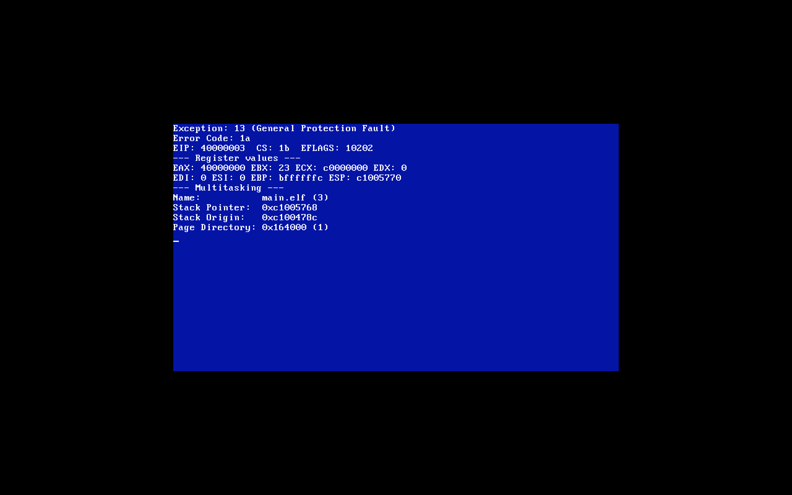

[Back to journal.md](../journal.md)

# Proper ELF Executor - *30th Mar, 2026*

There has to be some way to just see where the problem is. I realised a fault in my design - some places I use physical addresses, other places virtual addresses, and I was too stupid to realise they aren't the same. I went back and fixed those, but still nothing was working.

I made it so that the ELF get a temporary virtual memory address to do some stuff, and store it. I made this to print out the contents of the ELF file using this.

```cpp
if (size_to_copy > 0 && temp_ptr[0] == 0) { // TODO REMOVE
    printf("EXEC FAIL: Phys %x\n", phys);
    for (size_t i = 0; i < size_to_copy; i++) {
        printf("%d ", temp_ptr[i]);
    }
    printf("\n");
}
```

By "content", I specifically mean what the OS has found to be the `_start` of the ELF file. The actual file buffer is full and seems to be good, but it seems that somewhy we can't get the actual `_start` of the code. During the refactor, I also realised that I define a bunch of stuff in the headers from the Google docs notes I make, but never seem to actually use them in the code, so maybe I'll fix that some day too.

I recall that I said moving section by section would help solve this problem, and since the file system stuff seems to work perfectly, let's move past it, the header creation, checks, etc.

```cpp
uint32_t* user_pd_phys = (uint32_t*) pmm_alloc_page();

if (!user_pd_phys) {
    printf("ELF Error: Failed to allocate page directory\n");
    kfree(file_buffer);
    return false;
}
```

This is the first this - we create a page in the PMM for our use. Now, instead of just moving through the logic, I'm also going to be going through tests. To test this, I need to make sure that `pmm_alloc_page` isn't giving me back something from the kernel's space:

```cpp
if ((uint32_t) user_pd_phys < 0x100000) {
    printf("PMM ERROR\n", user_pd_phys);
}
```

I never saw this message pop up, therefore our function has properly given something above the kernel. Perfect. This let's us move to the next section:

```cpp
uint32_t* original_pd = vmm_get_current_directory();
vmm_map_page(user_pd_phys, (void*) VMM_TEMP_PAGE, PAGE_PRESENT | PAGE_RW);
uint32_t* user_pd_virt_handle = (uint32_t*) VMM_TEMP_PAGE;
```

We first bookmark where in the VMM we are right now, then map a temporary page from the VMM to the PMM page we just allocated, then we create a small handle to that temporary page. To test if this works, we just test if writing to the VMM makes sure we write to the PMM, and that the bridge is bridging.

```cpp
user_pd_virt_handle[0] = 0x12345678;
user_pd_virt_handle[1023] = 0x87654321;

asm volatile("invlpg (%0)" : : "r"(VMM_TEMP_PAGE) : "memory");

if (user_pd_virt_handle[0] != 0x12345678 || user_pd_virt_handle[1023] != 0x87654321) {
    printf("VMM BRIDGE FAILURE: Wrote to %x (Phys: %x), but read back garbage :(\n",
            VMM_TEMP_PAGE, user_pd_phys);
}

return false; // Don't let the function continue off with trash values
```

Unfortunately, when I ran this, I saw:

```
VMM BRIDGE FAILIURE: Wrote to fe000000 (Phys 17e000), but read back garbage :(
```

This means that writing through the VMM doesn't exactly literally write into the PMM for us, which, as you may imagine, would cause the thing to not work. The good news is that we have identified our problem (or atleast one of them). Since the `original_pd` doesn't get used here yet, we can move on without having to check if `vmm_get_current_directory` works or not, but we do have to get into the `vmm_map_page` function, which starts as follows:

```cpp
void vmm_map_page(void* phys, void* virt, uint32_t flags) {
    uint32_t virt_addr = (uint32_t) virt;
    uint32_t pd_index  = virt_addr >> 22;
    uint32_t pt_index  = (virt_addr >> 12) & 0x3FF;
```

The `pd_index` is the top 10 bits, and they select one of the 1024 entries in the Page Directory. The `pt_index` is the middle 10 bits, and they select one of the 1024 entries in a Page Table. Since these are just variables, there's nothing to check, so let's move on.

```cpp
if (!(PAGE_DIR_VIRTUAL[pd_index] & PAGE_PRESENT)) {
    uint32_t phys_table = (uint32_t) pmm_alloc_page();
    PAGE_DIR_VIRTUAL[pd_index] = phys_table | PAGE_PRESENT | PAGE_RW | PAGE_USER;

    // Flush the specific Page Table window in the recursive map
    void* pt_window = (void*) PAGE_TABLE_VIRTUAL(pd_index);
    asm volatile("invlpg (%0)" : : "r"(pt_window) : "memory");

    // Zero out the new table using its virtual handle
    uint32_t* table_ptr = (uint32_t*) pt_window;
    for (int i = 0; i < 1024; i++) table_ptr[i] = 0;
}
```

This checks if a Page Table already exists for that 4MB chunk of memory. If it doesn't, we allocate a page table, put it into the page directory, and finally zero it out. Although we allocated the page earlier, it is possible the kernel has never used the memory here, so we actually expect this `if` statement to run. Unfortunately, the VMM is a very low level part of the kernel, and, thus, we really cannot put a `printf` in there, because it relies on the heap, that doesn't exist in the VMM. The heap exists *after* the VMM, therefore we don't have a value to do it.

The solution to not having our `printf` is to have a `test.h` file that we include in (this file will be gitignored and completely deleted from the final source code), and it contains just:

```cpp
#ifndef FARIX_TEST_VALUES_H
#define FARIX_TEST_VALUES_H

extern int test_value_int;

#endif
```

Of course, we can have more variables, like charcaters for storing text, and reading from the shell. The only constraint is that everything must be primitive. I made the VMM increment to `test_value_int` whenever the if-statement executes. In order to see the value, we can have a shell command:

```cpp
void cmd_test(const std::string& args) { // TODO REMOVE
    printf("%d\n", test_value_int);
}
```

I ran the kernel, `test`, saw `0`, then ran `exec main.elf`, `test`, then saw `1`, implying that this if-statement has indeed run. Now, to test if the first part of the if-statement is correct:

```cpp
if (!(PAGE_DIR_VIRTUAL[pd_index] & PAGE_PRESENT)) {
    uint32_t phys_table = (uint32_t) pmm_alloc_page();
    PAGE_DIR_VIRTUAL[pd_index] = phys_table | PAGE_PRESENT | PAGE_RW | PAGE_USER;

    test_phys_addr = phys_table; // TODO REMOVE
    test_pde_value = PAGE_DIR_VIRTUAL[pd_index];
```

(The two test values are `uint32_t` defined in the `test.h` file). When I did this and checked what the values were, I see this:


If we take those two values, 1568768 is 0x17F000 in hexadecimal, which is good, because its above 1 MB, and doesn't mess with the kernel's memory space. The problem is in -2139030912, which is 0x80808280 in hexadecimal.

- The last digit of 0x80808280 is 0.
- If you added `0x1 | 0x2 | 0x4`, the last digit must be 7.

This means 0x80808280 is not correct. So we have to backtrack even more. Our defintions for those concerned macros are in [`vmm.h`](../../include/memory/vmm.h):

```cpp
#define PAGE_PRESENT  0x1   // 01 in binary  - If page is in RAM
#define PAGE_RW       0x2   // 10 in binary  - 0 = Read-only,   1 = Read/Write
#define PAGE_USER     0x4   // 100 in binary - 0 = Kernel only, 1 = Everyone

#define PAGE_DIR_VIRTUAL   ((uint32_t*) 0xFFFFF000)
#define PAGE_TABLE_VIRTUAL(pd_index) ((uint32_t*)(0xFFC00000 + ((pd_index) * 4096)))
```

We see we aren't reading back the value we're writing in. What is contradictive is this:

```cpp
PAGE_DIR_VIRTUAL[pd_index] = 0xDEADBEEF;
uint32_t verify_magic = PAGE_DIR_VIRTUAL[pd_index];

test_phys_addr = verify_magic; // TODO REMOVE
test_pde_value = PAGE_DIR_VIRTUAL[pd_index];
```

Both values are exactly the same. I am at a loss of words. I have no clue why, but I decided to give up and ask Gemini what this is, and it said:

> If test_corr_value was 1568775 (0x17F007), but the directory read back 0x80808280, it suggests that PAGE_DIR_VIRTUAL[pd_index] was already 0x80808280 before you even started, and your assignment didn't happen.
> 
> Why would an assignment fail if the memory is writable? C++ Operator Precedence or Casting.
>
> Look at this line again:
> PAGE_DIR_VIRTUAL[pd_index] = phys_table | PAGE_PRESENT | PAGE_RW | PAGE_USER;
>
> If phys_table is a uint32_t, this should be fine. But let's verify one thing. What happens if we force the math? Try this specific block to see if the "garbage" value is coming from the assignment itself:

The suggestion was, as far as I can tell, no different to what was being done.

```cpp
uint32_t phys_table = (uint32_t) pmm_alloc_page();

uint32_t flags = PAGE_PRESENT | PAGE_RW | PAGE_USER;
uint32_t value_to_write = phys_table | flags;

PAGE_DIR_VIRTUAL[pd_index] = value_to_write;

// test_phys_addr = phys_table; // TODO REMOVE
test_phys_addr = value_to_write; // TODO REMOVE
test_pde_value = PAGE_DIR_VIRTUAL[pd_index];
test_corr_value = phys_table | PAGE_PRESENT | PAGE_RW | PAGE_USER;
```

And now all three variables have the same value. What - the - hell. Am I delusional? Did I run it wrong? Why does C++ even have to work like this? Regardless, the ELF exec still screams the VMM bridge fail message, so we have more to go through.

```cpp
// Flush the specific Page Table window in the recursive map
void* pt_window = (void*) PAGE_TABLE_VIRTUAL(pd_index);
asm volatile("invlpg (%0)" : : "r"(pt_window) : "memory");

// Zero out the new table using its virtual handle
uint32_t* table_ptr = (uint32_t*) pt_window;
for (int i = 0; i < 1024; i++) table_ptr[i] = 0;

test_pt_virt = (uint32_t) pt_window;
test_pt_first_entry = table_ptr[0];
```

Now, we expect the first entry test value to be 0. Instead, when I ran this, `test_pt_virt` was -32768 ($-2^{15}$, math part of me kicking in), and `test_pt_first_entry` is 203244681 (slightly more than 0). This means the for-loop did not zero out the Page Table. It wrote zeros to some other part of the kernel's memory (because `pt_window` was wrong), and you're reading back whatever random data happened to be at that address. It seems one of the problems lied here:

```cpp
#define PAGE_TABLE_VIRTUAL(pd_index) ((uint32_t*)(0xFFC00000 + ((pd_index) * 4096)))
```

To be fair, I am relying on Gemini CLI to just find me the bugs (most of the code is written at 1 am; I have no time in the day). This obviously overshoots the value by a factor of 4, so we have to tone it down, and I used the bit movement operator thingy, because I realised its all powers of 2, and it might be better.

```cpp
#define PAGE_TABLE_VIRTUAL(pd_index) ((uint32_t*)(0xFFC00000 + ((pd_index) << 12)))
```

Obviously, this doesn't change a thing.

*30th Mar, 2026*

Ok, so I haven't been journalling a lot, because I currently look like a mad-scientist who just figured out the correct recipe to some magic potion. For some reason, my problems this whole time was a set of stupid errors I had forgotten to fix. Since the ELF wouldn't execute, and I had no clue why, I deicided to create a new branch, `elf-fixing`, and fix it there, and merge back to main quickly. This took like a month, and I didn't expect it.

First of all, I realised that the ELF wasn't executing right because the memory wasn't working at the VMM level. I went off to fixing it, and I think I mentioned it earlier, but I moved to direct mapping just to help myself out with the debugging. I don't mind it for now, I hope we can swap it out easily later for the recursive mapping we used to have. To verify the changes and to make the fixes actually fixed, I made shell commands that checked everything, so I can go and spot where anything went wrong. I may have committed some of them in some WIP commits, not sure.

Unfortunately, changing out how the memory works completely messed up `std::string` and `std::map`, so I stopped using them, and realised - the whole code became C, so why keep using C++? So I spent 2 days of my life rewriting the kernel into C. But when I say how much I hit my head on the wall for this - I forgot to turn on paging this whole time! I am so STUPID, like I built all this, and just forgot paging completely. I want back and changed around everything, and made it all work.

I then went back to the ELF and realised everything was finally not 0s, but it was like nothing was still working. I wasn't exactly sure, but I knew we were close. The summary of the problem for the ELF triple faulting was that I had updated the syscalls registers struct but had forgotten to update the assembly in [`boot.s`](../../src/boot.s) (deprecated), so I was basically using the wrong registers, which was causing all the random triple faults, because `iret` wanted everything exact. When I fixed that, everything was working! I wrote a quick ELF:

```c
#include "farix.h"

#define SYS_WRITE 1

__attribute__((section(".text.prologue")))
void _start() {
    const char* msg = "Farix is alive!\n";
    int len = 16;

    asm volatile (
        "mov %0, %%eax\n"  // SYS_WRITE
        "mov %1, %%ebx\n"  // file descriptor 1 (stdout)
        "mov %2, %%ecx\n"  // buffer pointer
        "mov %3, %%edx\n"  // length
        "int $0x80\n"
        :
        : "i"(SYS_WRITE), "i"(1), "r"(msg), "r"(len)
        : "eax", "ebx", "ecx", "edx"
    );

    while(1);
}
```

Then when I ran it, I cried:


This was absolutely fantastic, I got the thing to run. Just to make sure, I did get it working earlier, but it wouldn't do any kernel panics if a user process did kernel stuff, and since the memory is good now, that shouldn't be the problem. So I wrote purposefully failing programs:

```c
#include "farix.h"

__attribute__((section(".text.prologue")))
void _start() {
    asm volatile ("int $3");
    while(1);
}
```

So when I ran it, the other eye finally shed the tear:



*(Yes, I made it look like a BSOD).* I loved it a LOT! To be fair, I have no clue if it perfectly works, but if it doesn't... I will cry even more. It's literally 12 am right now, as I write this. I don't know when I'm committing it though, but I am going to test a bit more around, just to get me a bit more confident over it.

I think it works, and I can finally merge the branches, it's been so long since I made a proper commit to `main`, there is so many changes. I want an HAL (Harware Abstraction Layer) at some point, but I feel I should, for my personal mental health, avoid fixing more kernel stuff, and start doing a bit more higher level components of it - like the shell.

I realise I probably should have written everything here, but I just didn't feel like it was exactly worth coming back to this file to just put my frustrations over, and I am not sure why because that was exactly why I made this file in the first place. Regardless, I tried making a kernel, and I finally finished one step.

It should be clear, I tried to use the big bad A-word (Articial Intelligence) to help me find the error in the ELF this whole time, and you know what happened? It sabotaged the entire thing. For some reason, AI just assumes a bunch of stuff. So everything written by AI had to be erased for my version of stuff. So, as of now, nothing in the kernel is AI.

Just to cheer me up, I asked Chat GPT to tell me some bedtime stories:

> *Tell me specific instances of components Linus Torvalds had troubles with while making Linux.*

I am in my sadistic stage of kernel development, but with this, I slowly came to the realisation - Linus, and any other developer, were humans, and so me forgetting to enable paging is a human error. I feet smart and dumb at the same time. It also seems to me that Linux was going in a similar flow as my small kernel here. I think it's really prophetic the next commit is on line 1000 of this journal, whatever it is, better not take another month.
