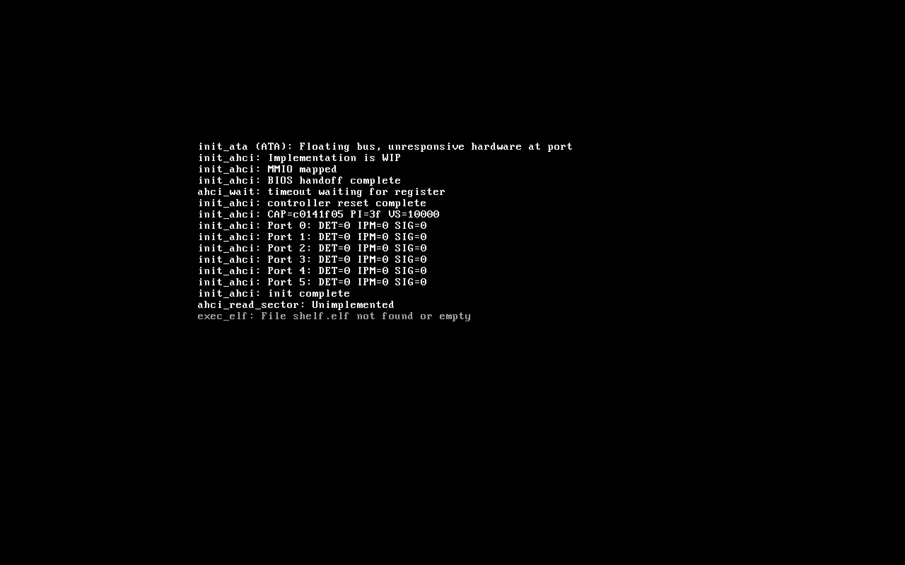

[Back to journal.md](../journal.md)

# Slab allocated ACPI

*20th April, 2026*

My kernel was not testable on my real computer, because it apparently runs on whatever AHCI is (sounds like someone sneezed). ATA worked perfectly, on any emulation, so I needed AHCI to work. Unfortunately, I found out we needed an abstraction layer, so I decided to call this layer - Block Device Layer. Why? I have no clue, Chat GPT suggested it when I asked it what to name it.

It's literally the same as the VFS, but for the hardware. It feels so stupid: literally all the abstraction layers in my kernel (as of now) are in the file management stuff, unless I'm forgetting someone. File systems are dumb, why couldn't it all just be easier? To be honest: I can't get it working, I don't know why, and I am 100% sure its QEMU's fault.

While I was bored, I decided to make these macros:

```c
#define likely(x)   __builtin_expect(!!(x), 1)
#define unlikely(x) __builtin_expect(!!(x), 0)
#define FREQ_FUNC   __attribute__((hot))
#define RARE_FUNC   __attribute__((cold))
```

This was purely for the fun of spamming these everywhere. It felt nice, even though it didn't matter, because the machine code executed that fast already, it felt good to have. I will definitely be spamming these more. In fact, I make the compiler `-include include/kernel.h` just to make this more automated. The compile time will be slightly slower, but since the `kernel.h` file is small, it will mostly pass by quickly. Runtime will not at all be affected, except the code is slightly faster, and even if it's by literal microseconds, I'm happy.

While moving through my own code, I realised there were plenty of... flaws, I suppose, just problems. I left `TODO` markings wherever I felt like it could have improvements, and I also removed a couple duplications.

I'll think of how to fix AHCI later, I'm just going to push this WIP into a branch so that I can keep track of everything.

*21st April, 2026*

I tried to fix it out, ran it on a real computer, and it seems I might be getting close. I'm mostly switching between my own assumptions, documentation, and LLM (often useless). As of the current code, I get this in my computer:

```
init_ahci: Implementation is WIP
init_ahci: MMIO mapped
init_ahci: BIOS handoff complete
ahci_wait: timeout waiting for register
init_ahci: controller reset complete
init_ahci: CAP=e730ff45 PI=11 VS=10300
init_ahci: Port 0: DET=0 IPM=0 SIG=0
init_ahci: Port 4: DET=0 IPM=0 SIG=0
init_ahci: init complete
ahci_read_sector: Unimplemented
```

And of course, since there is no system to read the files, shelf doesn't execute (not like it can, my computer doesn't have the application, I'll have to figure that out later). I can make it load into kernel shell I suppose, but whatever. I might have that later if the debugging becomes that annoying. As of now, I have no clue why. I booted the computer into Linux to verify that AHCI is present; it is, it just won't work for my kernel. I don't know why, I hate that I don't know why, and I wish someone actually wrote proper documentation. My only documented source is the OSDev wiki, only because literally nothing else exists. QEMU is worse (or better, I don't know).



*Yes, I went into the 6th March, 2026, journal entry to remember how to put images in markdown, and yes, I noticed the picture isn't there, I don't know what happened there, the date is probably (100%) wrong.*

One fear I have of the AHCI is that, apparently, it *could* have access to my computer's actual hard disk. If I firetruck up the code, I *may* brick the entire computer. It's not important for me, but I only have two testing computers, and one programming computer. These testing computers are old computers that no one uses anymore, but I prefer having them around for these kind of stuff. If they stop working, then I have no way to test my kernel properly on real hardware. I definitely am not going to run it on my main computer.

AHCI is the only scare part right now, has too much power, and depends on the PMM and VMM, which is never a good sign. The IDE mode, ATA, works perfectly fine, but AHCI seems to be an actual nuisance. I remember mentioning it in an older journal entry, and I said I was going to leave it for some time or something. It seems if I don't have this, the kernel is kinda useless, and everything I have made is useless. What's the use of a computer that runs everything perfectly but can't run anything? I might figure it out someday by just tinkering around, unfortunately, that day is definitely not today.

*11:23 pm*

I later got bored, and realised my assembly stubs take precious microseconds from the total runtime. To solve this, I changed everything to make this one file a header file, then the rest of the kernel can use this header for its assembly functions. The compilation sequence accommodates for it too. I suppose it's not much, but it probably compounds a lot, and doing this early is better than never. Also makes the code ever so slightly cleaner. I also took advantage of that and moved all the headers to the arch folder, just so the separation is slightly cleaner. I changes nothing code-wise, but it does for future me.

As for the ARM32 architecture... it's quite cooked, I'm not even bothered over it anymore. To be frank, I only left it in the code just because I wanted it to be clear that adding a new architecture is possible. I just don't get ARM, so until I find the time to actually go and study the RISC architecture model, I'm not going to fix it. I only leave it there, so that future HAL won't be a hassle. If I don't have it, I might make the code "too" x86, and, thus, make porting a nightmare.

*22nd April, 2026*

I realise a small annoyance in the dependancies: For the AHCI, I need the APIC; for the APIC, I need the ACPI; for the ACPI, I need proper ACPICA; for the ACPICA, I need to make it work through slabs, because currently, it's terrible. It has this PMM/VMM dance to allocate memory, and it's honestly the biggest waste of memory in the entire kernel. The solution is to use slabs, but I want to use it in a very particular way, but that requires me to have differently sized slabs.

I, thus, made slabs that hold 32 objects, 16, and 8, instead of just the 64. The code is wet, and I can't be bothered: the slab is for absolute speed, it is better for me to optimise specific slabs easily as a result. With my slabs, I should be able to make the ACPI use memory better.

*23nd April, 2026*

Came home from school, didn't sleep. I was just bored, and I wrote the ACPI to use the slab allocator. I'll do some more later; I'm just tired, but I had a lot of plans, not sure if I'll finish them today. I just made it start using interrupts, so I hope it won't overwrite my IDT or something. I have no clue if the HAL will work once I try to get more architectures, but I'm not bothered, as long as it works on x86 (32 bit too), it's fine for me.
